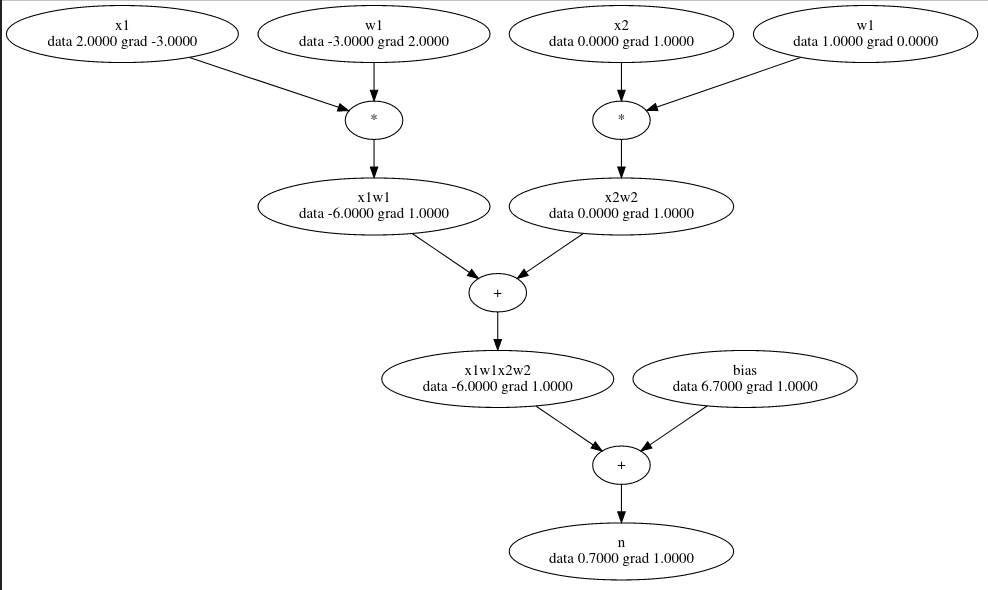

# Micrograd-rs

Implementation of [micrograd](https://github.com/karpathy/micrograd) as demonstrated in Andrea Karpathy's 
YouTube video found [here](https://www.youtube.com/watch?v=VMj-3S1tku0)



## Example using the expressions

```rust        
let mut expr = Expression::default();

// inputs x1 and x2
let x1 = expr.new_value("x1", 2.0);
let x2 = expr.new_value("x2", 0.0);

// weights w1 and w2
let w1 = expr.new_value("w1", -3.0);
let w2 = expr.new_value("w1", 1.0);

// bias of a neuron
let bias = expr.new_value("bias", 6.7);

// x1*w1 + x2*w2 + bias
let x1w1 = expr.mul("x1w1", x1, w1);
let x2w2 = expr.mul("x2w2", x2, w2);
let x1w1x2w2 = expr.add("x1w1x2w2", x1w1, x2w2);
let n = expr.add("n", x1w1x2w2, bias);

// back prop
expr.back_prop(n).unwrap();

// dump the expression as a dot file
expr.as_dot("/tmp/dot.dot");
```

## Example of the binary neural net

```rust
let mut expr = expression::default();

let xs = [
    [2.0, 3.0, -1.0],
    [3.0, -1.0, 0.5],
    [0.5, 1.0, 1.0],
    [1.0, 1.0, -1.0]
];

let desired_targets = [1.0, -1.0, -1.0, 1.0];

// create the mlp for this example
let mlp  = expr.new_mlp(xs[0].len(), &[4, 4, 1]);

// add the output prediction nodes to the expression
let mut y_predictions = vec::new();

// Gather the current predictions
for x in xs {
    let out = expr.activate_mlp(&mlp, &x)[0];
    y_predictions.push(out);
}

// add a loss node to the graph
let mut loss = expr.new_value("loss", 0.0);
for (target, prediction) in desired_targets.iter().zip(y_predictions.iter()) {
    let target = expr.new_value("_", *target);

    let sub = expr.sub("losssub", *prediction, target);
    let two = expr.new_value("two", 2.0);
    let pow = expr.pow("losspow", sub, two);

    loss = expr.add("loss", pow, loss);
}

// optimize the expression, minimizing the loss
let mut curr_loss = 10.0;
let mut iters = 0;

while curr_loss >= 0.001 { 
    curr_loss = expr.get_value(&loss);

    // Naive nudge values
    let nudge = if curr_loss <= 0.01 {
        -0.0001
    } else if curr_loss <= 0.1 {
        -0.001
    } else {
        -0.01
    };

    // Zero gradients
    expr.zero_grad();

    // Back propagate
    expr.back_prop(loss).unwrap();

    // Nudge the expression by the newly found gradients
    expr.nudge_by(nudge);
}
```

```
--- PREDICTIONS BEFORE ---
 0.75320630 | wanted  1.00000000
 0.42802739 | wanted -1.00000000
 0.64872703 | wanted -1.00000000
 0.52563813 | wanted  1.00000000
test tests::it_works_easy ... ok
--- Basic statistics of the optimization process ---
Cycles per optimization iter: 1879549.51
    GetLoss  | 0.0000%
    ZeroGrad | 0.0071%
    BackProp | 0.9840%
    Nudge    | 0.0088%
--- PREDICTIONS AFTER ---
 0.99999069 | wanted  1.00000000
-0.99994616 | wanted -1.00000000
-0.99993783 | wanted -1.00000000
 0.99998211 | wanted  1.00000000

.dot file written to /tmp/dot.dot
dot -Tsvg /tmp/dot.dot > /tmp/dot.svg
```
